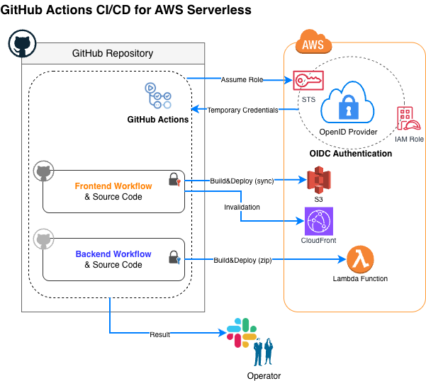

# AWS Serverless CI/CD Templates with GitHub Actions

[](LICENSE)

AWS(S3 / CloudFront / Lambda)へのフロントエンド・バックエンド自動デプロイを行うための、GitHub Actions ワークフローのテンプレート(ボイラープレート)です。

認証にはセキュリティベストプラクティスである **OIDC (OpenID Connect)** を採用し、GitHub側に長期間有効なAWSアクセスキー(クレデンシャル)を保持させないセキュアな構成としています。


## 🏛 Architecture
* **Frontend**: React / Next.js などの静的ビルドファイルを AWS S3 へ同期し、CloudFront のキャッシュを自動クリア(Invalidation)します。
* **Backend**: Node.js / TypeScript コードをビルド・ZIP化し、AWS Lambda へ自動デプロイします。
* **Notification**: CI/CDの成功・失敗ステータスを Slack チャンネルへ自動通知します。




## 📁 Repository Structure
```text
.
├── .github/workflows/
│   ├── deploy-frontend-main.yml  # フロントエンド用 CI/CD (S3 + CloudFront)
│   └── deploy-backend-main.yml   # バックエンド用 CI/CD (Lambda)
├── frontend/                     # フロントエンドのソースコード配置想定
└── backend/                      # バックエンドのソースコード配置想定
```


## 🚀 How to Use
このワークフローをご自身のプロジェクトに導入する際の手順を挙げます。

### 1. AWS IAM / OIDC の事前準備
AWS上に GitHub Actions 用の OIDC プロバイダ (token.actions.githubusercontent.com) を作成し、デプロイ用の IAM Role を準備します。

> **⚠️ Security Note: 信頼関係(Trust Policy)の制限**
> OIDC用のIAM Roleを作成する際、必ず「信頼されたエンティティ」の条件(Condition)で、ご自身のGitHubリポジトリからのみAssumeRoleできるよう制限をかけてください。
> StringLike: token.actions.githubusercontent.com:sub -> repo:<Your-GitHub-Org>/<Your-Repo>:*


#### 1-1. OIDC用IAM RoleのTrusted entities設定例
```json
{
	"Version": "2012-10-17",
	"Statement": [
		{
			"Effect": "Allow",
			"Principal": {
				"Federated": "arn:aws:iam::<AWS Account ID>:oidc-provider/token.actions.githubusercontent.com"
			},
			"Action": "sts:AssumeRoleWithWebIdentity",
			"Condition": {
				"StringEquals": {
					"token.actions.githubusercontent.com:aud": "sts.amazonaws.com"
				},
				"StringLike": {
					"token.actions.githubusercontent.com:sub": "repo:<Your-GitHub-Org>/<Your-Repo>:*"
				}
			}
		}
	]
}
```

#### 1-2. 必要な IAM ポリシーの権限(FE用とBE用)

**Frontend 用 IAM Roleに付与する権限:**
```json
{
  "Version": "2012-10-17",
  "Statement": [
    {
      "Effect": "Allow",
      "Action": [
        "s3:PutObject",
        "s3:DeleteObject",
        "s3:ListBucket"
      ],
      "Resource": [
        "arn:aws:s3:::<S3 bucket名>",
        "arn:aws:s3:::<S3 bucket名>/*"
      ]
    },
    {
      "Effect": "Allow",
      "Action": "cloudfront:CreateInvalidation",
      "Resource": "arn:aws:cloudfront::<AWS Account ID>:distribution/<Distribution ID>"
    }
  ]
}
```

**Backend 用 IAM Roleに付与する権限:**
```json
{
  "Version": "2012-10-17",
  "Statement": [
    {
      "Effect": "Allow",
      "Action": "lambda:UpdateFunctionCode",
      "Resource": "arn:aws:lambda:ap-northeast-1:<AWS Account ID>:function:<Lambda Function名>"
    }
  ]
}
```


### 2. プレースホルダーの書き換え

`.github/workflows/` 内の YAML ファイルを開き、以下の `<...>` で囲まれた箇所を自身のAWS環境に合わせて書き換えてください。

```plaintext
<AWS Account ID> : AWSのアカウントID(12桁の数字)
<IAM Role名> : 作成したIAMロール名
<S3 bucket名> : デプロイ先のS3バケット名
<Distribution ID> : キャッシュクリア対象のCloudFront ディストリビューションID
<Lambda Function名> : デプロイ対象のLambda関数名
<通知先CH名> : Slackの通知先チャンネル名
```

> 💡 Note: キャッシュ機能について
> Actionsの依存関係キャッシュ機能を利用するため、事前にローカルで `npm install` や `yarn install` を実行し、`package-lock.json` や `yarn.lock` をリポジトリに含めてから Push してください。


### 3. GitHub Secrets の設定
GitHub リポジトリの `Settings > Secrets and variables > Actions` にて、以下のシークレットを登録してください。

| Name | Value |
| :----: | :----: |
| `SLACK_WEBHOOK_URL` | <Slack Incoming Webhook の URL> |


### 4. デプロイの実行
本テンプレートでは`main` ブランチへの Push(またはマージ)で自動的にワークフローがトリガーされます。また、GitHubの「Actions」タブから手動実行(`workflow_dispatch`)することも可能です。


## 📄 License
This project is licensed under the MIT License - see the [LICENSE](./LICENSE) file for details.
